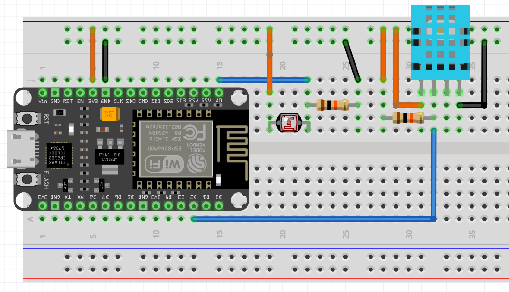

**Proyecto**

Este repositorio contiene el proyecto de la materia *4401 - IoT* de la Maestría en Ingeniería de Software de la Universidad de los Andes. El circuito a usar es el siguiente:



***Componentes***

Los componentes usados son: 
* Sensor de temperatura y humedad DHT11
* Placa de desarrollo Nodemcu V1 (ESP 12-E)
* Fotoresistencia GL5537
* Resistencias de 10K ohms

**Autores**

- **Jairo Reyes**: ja.reyesr1@uniandes.edu.co
- **Manuel Sanchez**: mg.sanchezb1@uniandes.edu.co

**Estructura del repositorio**

- `platformio.ini`: configuración del proyecto PlatformIO
- `src/`: código fuente (por ejemplo `src/main.cpp`)
- `include/`, `lib/`, `test/`: carpetas auxiliares del proyecto

**Requisitos**

- Visual Studio Code (opcional, recomendado)
- Python 3 (para instalación por CLI)
- PlatformIO (extensión de VSCode o CLI `platformio`)

**Instalación de PlatformIO**

1) Instalación como extensión en Visual Studio Code

- Abra Visual Studio Code.
- Vaya a la vista de extensiones y busque "PlatformIO IDE" o "PlatformIO".
- Instale la extensión y reinicie VS Code si se solicita.

2) Instalación por consola (CLI)

**Opción A: Usar `pipx` (recomendado para Debian/Ubuntu)**

En sistemas Debian/Ubuntu modernos (Python 3.11+), instale `pipx` primero:

```bash
sudo apt install pipx
```

Luego instale PlatformIO:

```bash
pipx install platformio
```

Compruebe la instalación:

```bash
pio --version
```

**Opción B: Virtual environment (alternativa)**

Si prefiere un virtual environment local:

```bash
# Crear virtual environment
python3 -m venv venv

# Activar (Linux/macOS)
source venv/bin/activate
# O en Windows: venv\Scripts\activate

# Instalar PlatformIO
python3 -m pip install --upgrade pip
python3 -m pip install -U platformio

# Compruebe la instalación
pio --version
```

Para usar PlatformIO en sesiones futuras, active el venv: `source venv/bin/activate`

**Opción C: Con pip (si su sistema lo permite)**

```bash
python3 -m pip install -U platformio
pio --version
```

Si recibe un error `externally-managed-environment`, use Opción A (pipx) o Opción B (venv).

**Configurar puerto y velocidad de carga**

El archivo `platformio.ini` contiene la configuración del puerto y velocidad de upload. Por defecto:

```ini
upload_port = /dev/ttyUSB0
upload_speed = 115200
```

**Para cambiar el puerto:**

- En Linux/macOS: Use `/dev/ttyUSBx` o `/dev/ttyACMx` (busque con `ls /dev/tty*`)
- En Windows: Use `COMx` (por ejemplo, `COM3`)

**Para cambiar la velocidad:**

Modifique `upload_speed` en `platformio.ini`. Valores comunes: `9600`, `115200`, `921600`.

**Autodetectar puerto en PlatformIO:**

Puede establecer `upload_port` como `auto` para autodetección:

```ini
upload_port = auto
```

**Compilar y ejecutar el proyecto**

Desde Visual Studio Code (recomendado):

- Abra la carpeta del proyecto en VS Code.
- Use el icono de PlatformIO en la barra lateral para `Build`, `Upload` o `Monitor`.
- Verifique el archivo `platformio.ini` para seleccionar el entorno objetivo.

Desde la consola (línea de comandos) en la raíz del repositorio:

```bash
# Compilar
pio run

# Limpiar artefactos de compilación
pio run --target clean

# Cargar (flashear) al dispositivo
pio run --target upload

# Monitorear puerto serie
pio device monitor

# Si existen múltiples entornos, especificar uno:
pio run -e <env>
pio run -e <env> --target upload
```

**Ejecutar pruebas**

Si el proyecto incluye tests, use:

```bash
pio test
# o para un entorno específico
pio test -e <env>
```

**Notas importantes**

- Revise `platformio.ini` para ver la plataforma, marco y entornos configurados.
- El archivo principal del ejemplo está en `src/main.cpp`.

**Siguientes pasos sugeridos**

- ¿Desea que ejecute una compilación de prueba aquí y comparta la salida?
- ¿Desea que haga un commit con este `README.md` y un push al repositorio remoto?
